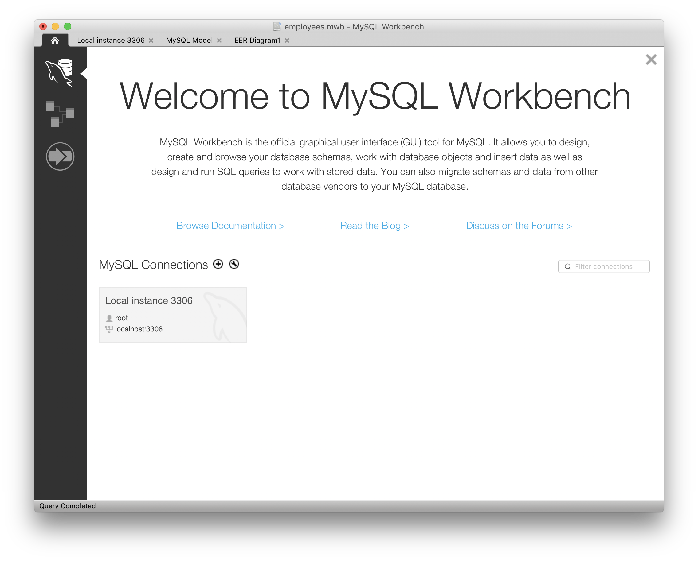
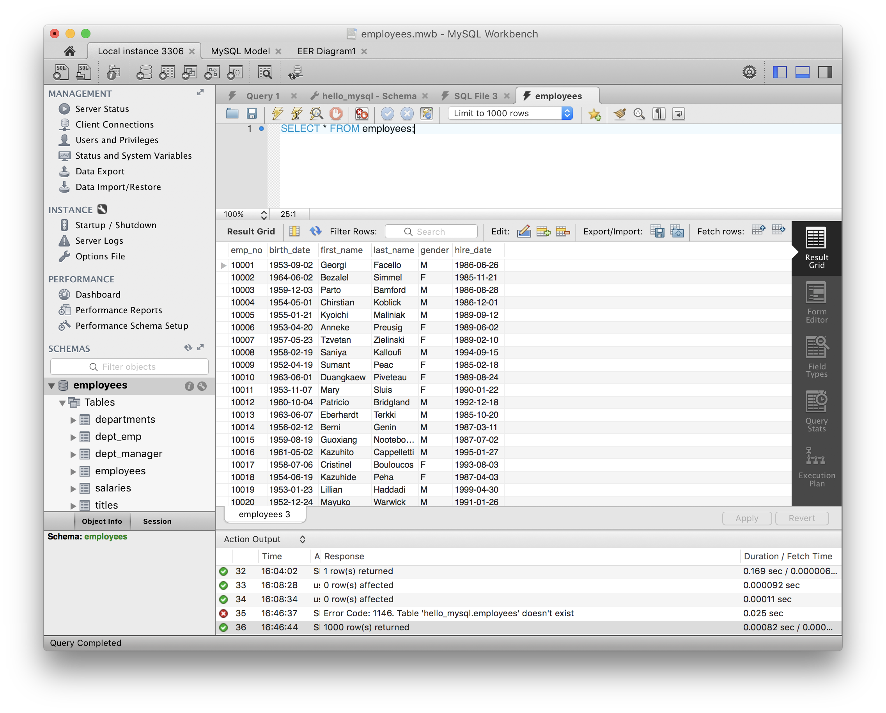

# 실습 환경 설치

## MySQL

  - 오픈소스 관계형 데이터베이스 중 가장 많이 사용됨
  - 다른 RDBMS에 비해 사용하기 쉽고 도구가 많음
  - 2009년 이후 오라클이 소유중이며, 무료 에디션과 상용 에디션이 있음

## MySQL 설치

### macOS

```
# macOS
$ brew install mysql
$ mysql_secure_installation
```

### Windows

[다운로드 링크](https://dev.mysql.com/downloads/windows/)

## 예제 데이터베이스 설치

[다운로드 링크](https://drive.google.com/open?id=0B7FmZRDPRZFvcDQ4eGtzSEt0UWs)

링크를 통해 다운로드 받아서 압축을 푼 뒤, 해당 폴더에서 아래 명령을 실행해주세요.

```mysql -uroot -p < employees.sql```

윈도우의 경우, 위 명령을 실행할 때 Git bash 대신 명령 프롬프트를 이용해주세요. `mysql` 명령의 실행을 위해 환경변수 설정이 필요할 수 있습니다.

## MySQL Workbench 설치
구글에서 검색해서 설치를 진행.


하단의 just start my download. 클릭해서 다운로드.


## 데이터 불러오기



