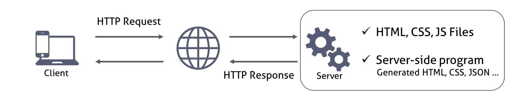

# avascript Asynchronous processing model
비동기식 처리 모델과 이벤트 루프

## 1. 브라우저의 동작 원리

## 2. Ajax


## 3.  동기식 처리 모델 vs 비동기식 처리 모델
비동기는 순서가 정해져 있지 않음. - 비절차적
  - 처리속도는 빠름.
동기식 (Synchronous)
비동기식 (Asynchronous)

순서가 보장되지 않음.
```javascript
function func1() {
  console.log('func1');
  func2();
}

function func2() {
  setTimeout(function() {
    console.log('func2');
  }, 0);

  func3();
}

function func3() {
  console.log('func3');
}

//unc1();
```

## 이벤트 루프와 동시성(Concurrency)
단일 쓰레드는 쓰레드가 하나뿐이라는 의미이며 이말은 곧 하나의 작업(task)만을 처리할 수 있다는 것을 의미한다.

- Call Stack(호출 스택)  
작업이 요청되면(함수가 실행되면) 요청된 작업은 순차적으로 Call Stack에 쌓이게 되고 순차적으로 실행된다. 자바스크립트는 단 하나의 Call Stack을 사용하기 때문에 해당 task가 종료하기 전까지는 다른 어떤 task도 수행될 수 없다.  
- Heap
동적으로 생성된 객체 인스턴스가 할당되는 영역이다.

```javascript
function func1() {
  console.log('func1');
  func2();
}

function func2() {
  // <button id="foo">foo</button>
  var elem = document.getElementById('foo');

  elem.addEventListener('click', function () {
    this.style.backgroundColor = 'indigo';
    console.log('func2');
  });

  func3();
}

function func3() {
  console.log('func3');
}

func1();
```
