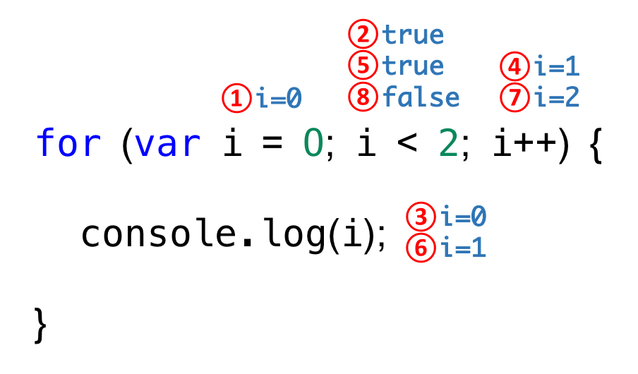

# 1. 블록 구문 (Block statement)
구문들의 집합으로 가장 기본이 되는 구문
- 중괄호로 그 범위를 정함.
- 함수, 객체리터럴, 흐름 제어 구문(control flow statement)에서 사용
```
// 함수
function foo() {
  var x = 1, y = 2;
  console.log(x + y);
}
foo();

// 객체리터럴
var obj = {
  x: 1,
  y: 2
};
console.log(obj.x + obj.y);

// 흐름 제어 구문(control flow statement)
var x = 0;
while (x < 10) {
  x++;
}
console.log(x);
```

# 2. 조건문 (Conditional statement)
> 프로그래밍(coding)은 요구사항의 집합을 분석하여 적절한 자료구조와 함수의 집합으로 변환한 후 그 흐름을 제어
자바스크립트는 2갸지의 조건문 `if ...else` 와 `switch`를 제공한다.
코드 블럭을 실행할 것인지 아닌지를 결정한다.

## 2.1. if문
조건식은 표현식이므로 하나의 값 (true/false)로 수렴될 수 있다.
```
if (조건식) {
  // 조건식이 참이면 이 코드블록이 실행된다. true or false로 평가 될 수 있는 식
} else {
  // 조건식이 거짓이면 이 코드블록이 실행된다. 옵션이므로 필요할 때 사용한다.
}
```
??? else if, else 구문의 사용 방법 추가 정리

```
var hour = 20;
var greeting;

// if 문
if (hour < 18) {
  greeting = 'Good day';
}

console.log(greeting);

// if-else 문
if (hour < 18) {
  greeting = 'Good day';
} else {
  greeting = 'Good evening';
}

console.log(greeting);  // 'Good evening' 이 출력된다.

// if-else if 문
if (hour < 10) {
  greeting = 'Good morning';
} else if (hour < 20) {
  greeting = 'Good day';
} else {
  greeting = 'Good evening';
}

console.log(greeting);
```

## 2.2. switch 문
??? 스위치문과 if문의 차이
스위치 변수가 어떠한 값을 가지고 있느냐에 따른 조건
```
var color = 'red';

// color = switch 변수
switch (color) {
  // color == 'yellow'인 경우 <<<< 이것을 케이스문이라 하고 케이스문에 적합한 값이 있을때 출력한다.>>>>
  case 'yellow':
    console.log('yellow color');
  // color == 'red'인 경우
  case 'red':
    console.log('red color');
  // color == 'blue'인 경우
  case 'blue':
    console.log('blue color');
  // 그외의 경우
  default:
    console.log('unknown color');
}
break 문이 없어서 모두 출력된다.

```
`break` keyword는 switch 구문에서 찰출하는 역할을 수행한다.
```
var color = 'red';

switch (color) {
  case 'yellow':
    console.log('yellow color');
    break;
  case 'red':
    console.log('red color');
    break;
  case 'blue':
    console.log('blue color');
    break;
  default:
    console.log('unknown color');
}
```

# 3. 반복문(Loop)
```
for, while, do while 3가지의 반복문
```
??? 3가지 반복문의 차이점을 이해하고 사용하자.  


# 3.1. for문
특정 조건이 거짓으로 판별될 때까지 반복
```
for ([초기문]; [조건문]; [증감문]) {
  구문;
}
```
```
for (var i = 0; i < 3; i++) {
  console.log(i);
}
```


거꾸로 순회하는 코딩
```
for (var i = 2; i >= 0; i--) {
  console.log(i);
}
```

> 배열을 순회하는 for문 // 나중에 배울것이므로 기본적인 for문만 배우고 갑시다.[이웅모 강사님]
```
var array = ['one', 'two', 'three', 'four'];

for (var i = 0; i < array.length; i++) {
  // console.log(array[i]);
  console.log('[' + i + '] = ' + array[i]);
}

// for-in
for (var index in array) {
  console.log('[' + index + '] = ' + array[index]);
}

// foreach
array.forEach(function (element, index, arr) {
  console.log('[' + index + '] = ' + element);
});

// for-of (ES6)
for (const element of array) {
  console.log(element);
}

for (const [index, value] of array.entries()) {
  console.log('[' + index + '] = ' + value);
}
```
> 객체를 순회하는 for문
```
var array = ['one', 'two', 'three', 'four'];

for (var i = 0; i < array.length; i++) {
  console.log(array[i]);
}

```

```
var i = 0;
for (;;) { // 무한루프
  if (i >= 3) {
    break;
  }
  console.log(i);
  i++;
}
```

# 3.2. while문
조건문이 거짓이되어 실행을 종료하고 반복문을 빠져나갈때까지 계속해서 반복 실행한다.
```
var n = 0;
var x = 0;

// n이 3보다 작을 때까지 계속 반복한다.
while (n < 3) {
  n++;    // n: 1 2 3
  x += n; // x: 1 3 6
  console.log(x);
}
```
> 참인 경우 무한루프
```
var i = 0;
// 무한루프
while (true) {
  console.log(i);
  i++;
}
```
> 무한루프를 탈출하기 위해 break문을 사용
```
var i = 0;
// 무한루프
while (true) {
  console.log(i);
  i++;
  // i가 10이면 exit!
  if (i === 10) break;
}
```
# 3.3. do while문
조건문을 확인하기 전에 무조건 1회 우선실행
```
var i = 0;
do {
  console.log(i);
  i++;
} while (i < 3);
```
# 3.4. continue 
continue문은 이후 구문의 실행을 스킵(생략)하고 반복문의 조건문으로 이동한다.
```
for (var i = 0; i < 5; i++) {
  if (i % 2 == 0) continue;
  console.log(i); // 짝수이면 출력안하고 홀수 인 경우 출력
}
```
# 4. 평가(Evaluating)
```
if (1) {
  console.log('1'); // 결과적으로 조건문이 필요 없이 콘솔만 사용해도 됨.
}

if ('str') {
  console.log('2'); // 함수할 때 인자라는 것을 받을때 많이 쓰임
}

if (true) {
  console.log('3');
}

if (null) {
  console.log('4');
}

var x = '';

if (x) {
  console.log('5'); // false
}

if (!x) {
  console.log('6'); // true
}
```

# 4.1. 암묵적 강제 형 변환 (Type coercion)
Javascript는 context(문맥)을 고려하여 내부적으로 자료형을 암묵적으로 강제 변환하여 작업을 완료할 수 있다. 이는 의도하지 않은 값을 만들어낼 수 있어 주의가 필요하다.
```
console.log('1' > 0);            // true 부등호때문에 숫자1로 강제 형변환
console.log(1 + '2');            // '12' 문자열
console.log(2 - '1');            // 1 - 연산자기준으로 숫자로 형변환
console.log('10' == 10);         // true
console.log('10' === 10);        // false
console.log(undefined == null);  // true 
console.log(undefined === null); // false 타입까지 보므로 false값
``` 
- 실수를 유발하므로 사용하지 않는 것이 좋으며 알아만 둔다.

  

# 4.2. Type Conversion Table
| Original Value | Converted to Number | Converted to String | Converted to Boolean |
|:-:|:-:|:-:|:-:|
| false | 0 | 'false' | false |
| true | 1 | 'true' | true |
| 0 | 0 | '0' | false |
| 1 | 1 | '1' | true |
| '0' | 0 | '0' | true |
| '1' | 1 | '1' | true |
| NaN | NaN | 'NaN' | false |
| Infinity | Infinity | 'Infinity' | true |
| -Infinity | -Infinity | '-Infinity' | true |
| " | 0 | " | false |
| '20' | 20 | '20' | true |
| 'twenty' | NaN | 'twenty' | true |
| [] | 0 | " | true |
| [20] | 20 | '20' | true |
| [10,20] | NaN | '10,20' | true |
| ['twenty'] | NaN | 'twenty' | true |
| ['ten','twenty'] | NaN | 'ten,twenty' | true |
| function(){} | NaN | 'function(){}' | true |
| {} | NaN | '[object Object]' | true |
| null | 0 | 'null' | false |
| undefined | NaN | 'undefined' | false |
0, undefined, 값이 없는 것등을 잘 살펴보고 패턴을 알아보자.

```
var x = false;
console.log('Number : ' + Number(x));
console.log('String : ' + String(x));
console.log('Boolean: ' + Boolean(x));
```

# 4.3. Data type conversion

```
var val = '123';
console.log(typeof val + ':' + val); // string

// sting -> number // 외울것
val = +val; 
// val *= 1;
// val = Number(val);
// val = parseInt(val);
console.log(typeof val + ':' + val); // number

// number -> sting // 외울것
val += '';
// val = String(val);
console.log(typeof val + ':' + val); // string
```

# 4.4. Truthy & Falsy values

아래 값들은 Boolean context에서 false로 평가된다.
```
false
undefined
null
0
NaN (Not a Number)
'' (빈문자열)
```
이들을 Falsy values라 한다.

```
var x = false;
if (!x)  console.log(x+' is falsy value');

x = undefined;
if (!x)  console.log(x+' is falsy value');

x = null;
if (!x)  console.log(x+' is falsy value');

x = 0;
if (!x)  console.log(x+' is falsy value');

x = NaN;
if (!x)  console.log(x+' is falsy value');

x = '';
if (!x)  console.log(x+' is falsy value');
```

# 4.5. Checking equality

> 두 값을 비교할 때에 동등연산자(==, !=)보다 일치연산자(===, !==)를 사용하여야 한다.
```
// logs false !!!
console.log(null == false);
console.log(undefined == false);
console.log(null == 0);
console.log(undefined == 0);
console.log(undefined === null);
console.log(NaN == null);
console.log(NaN == NaN);
```

# 4.6. Checking existence
단항 연산자를 활용한 존재 확인이 가능하다. 즉, 객체나 배열(배열도 객체이다)이 값을 가지고 있으면 truthy value로 취급된다.받는다. 이를 이용하여 존재여부를 확인할 수 있다.

```
if (document.getElementById('header')) {
  // 요소가 존재함 : 필요한 작업을 수행
} else {
  // 요소가 존재하지 않음 : 필요한 작업을 수행
}
```
위의 예와 다른 의미
```
if (document.getElementById('header') == true) // (삭제됨 - this condition evaluates to) false
```

주의해야 한다는데 무엇을??? true랑 비교할게 없는데 사용한것임.
```
var b = new Boolean(false);
if (b) // (삭제됨-this condition evaluates to) true
```


