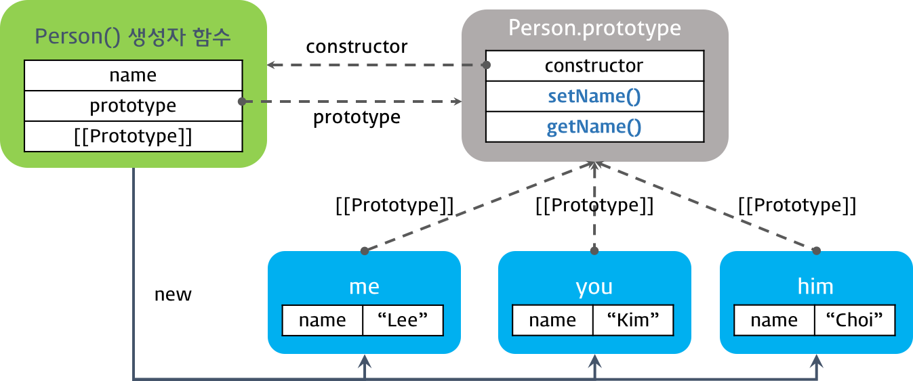

# 1. 객체지향 프로그래밍
> 객체지향 프로그래밍은 보다 유연하고 유지보수하기 쉬우며 확장성 측면에서서도 유리한 프로그래밍을 하도록 의도되었고, 대규모 소프트웨어 개발에 널리 사용되고 있다.

# 2. 클래스 기반 vs. 프로토타입 기반

패턴은 자주 바뀌고 지속적으로 변형되거니 지지를 받으면서 변화한다. 유행을 탐. ㅋㅋ

# 2.2. 프로토타입 기반 언어
자바스크립트는 멀티-패러다임 언어로 명령형(imperative), 함수형(functional), 프로토타입 기반(prototype-based) 객체지향 언어다. 비록 다른 객체지향 언어들과의 차이점에 대한 논쟁들이 있긴 하지만, 자바스크립트는 강력한 객체지향 프로그래밍 능력들을 지니고 있다. 간혹 클래스가 없어서 객체지향이 아니라고 생각하는 사람들도 있으나 프로토타입 기반의 객체지향 언어다.

- 객체 리터럴
- Object() 생성자 함수
- 생성자 함수   

```javascript
// 객체 리터럴
var obj1 = {}; // 자바스크립트의 장점중 하나이다.
obj1.name = 'hsoo';

// Object() 생성자 함수
var obj2 = new Object();
obj2.name = 'hsoo';

// 생성자 함수
function F() {}
var obj3 = new F();
obj3.name = 'hsoo';
```
> ECMAScript 6에서 새롭게 클래스가 도입되었다. ES6의 Class는 기존 prototype 기반 객체지향 프로그래밍보다 Class 기반 언어에 익숙한 프로그래머가 보다 빠르게 학습할 수 있는 단순하고 깨끗한 새로운 문법을 제시하고 있다. ES6의 Class가 새로운 객체지향 모델을 제공하는 것이 아니며 Class도 사실 함수이고 기존 prototype 기반 패턴의 Syntactic sugar이다.

# 3. 생성자 함수와 인스턴스의 생성
자바스크립트는 생성자 함수와 new 연산자를 통해 인스턴스를 생성할 수 있다. 이때 생성자 함수는 클래스이자 생성자의 역할을 한다.
```javascript
// 생성자 함수(Constructor)
function Person(name) {
  // 프로퍼티
  this.name // = name; 아래 메소드 함수가 있으므로 이꼴 뒤에는 필요가 없어 주석처리 함.

  // 메소드
  this.setName = function (name) {
    this.name = name;
  };

  // 메소드
  this.getName = function () {
    return this.name;
  };
}

// 인스턴스의 생성
var me = new Person('Lee');
console.log(me.getName()); // Lee

// 메소드 호출
me.setName('Kim');
console.log(me.getName()); // Kim

```

```javascript
var me  = new Person('Lee');
var you = new Person('Kim');
var him = new Person('Choi');

console.log(me);  // Person { name: 'Lee', setName: [Function], getName: [Function] }
console.log(you); // Person { name: 'Kim', setName: [Function], getName: [Function] }
console.log(him); // Person { name: 'Choi', setName: [Function], getName: [Function] }
```
# 4. 프로토타입 체인과 메소드의 정의

```javascript
function Person(name) {
  this.name = name;
}

// 프로토타입 객체에 메소드 정의
Person.prototype.setName = function (name) {
  this.name = name;
};

// 프로토타입 객체에 메소드 정의
Person.prototype.getName = function () {
  return this.name;
};

var me  = new Person('Lee');
var you = new Person('Kim');
var him = new Person('choi');

console.log(Person.prototype); 
// Person { setName: [Function], getName: [Function] }

console.log(me);  // Person { name: 'Lee' }
console.log(you); // Person { name: 'Kim' }
console.log(him); // Person { name: 'choi' }
```


```javascript
/**
 * 모든 생성자 함수의 프로토타입은 Function.prototype이다. 따라서 모든 생성자 함수는 Function.prototype.method()에 접근할 수 있다.
 * @method Function.prototype.method
 * @param ({string}) (name) - (메소드 이름)
 * @param ({function}) (func) - (추가할 메소드 본체)
 */
Function.prototype.method = function (name, func) {
  // 생성자함수의 프로토타입에 동일한 이름의 메소드가 없으면 생성자함수의 프로토타입에 메소드를 추가
  // this: 생성자함수
  if (!this.prototype[name]) {
    this.prototype[name] = func;
  }
};

/**
 * 생성자 함수
 */
function Person(name) {
  this.name = name;
}

/**
 * 생성자함수 Person의 프로토타입에 메소드 setName을 추가
 */
Person.method('setName', function (name) {
  this.name = name;
});
// 자바스크립트 신인 더글라스가....

/**
 * 생성자함수 Person의 프로토타입에 메소드 getName을 추가
 */
Person.method('getName', function () {
  return this.name;
});

var me  = new Person('Lee');
var you = new Person('Kim');
var him = new Person('choi');

console.log(Person.prototype);
// Person { setName: [Function], getName: [Function] }

console.log(me);  // Person { name: 'Lee' }
console.log(you); // Person { name: 'Kim' }
console.log(him); // Person { name: 'choi' }
```

# 5.1. 의사 클래스 패턴 상속 (Pseudo-classical inheritance)

```javascript
 // ②

  // 메소드 오버라이드
  Child.prototype.sayHi = function () {
    console.log('안녕하세요! ' + this.name);
  };

  // sayBye 메소드는 Parent 생성자함수의 인스턴스에 위치된다
  Child.prototype.sayBye = function () {
    console.log('안녕히가세요! ' + this.name);
  }; 

  // return constructor
  return Child;
}());

var child = new Child('child'); // ①
console.log(child);  // Parent { name: 'child' }

console.log(Child.prototype); // Parent { name: undefined, sayHi: [Function], sayBye: [Function] }

child.sayHi();  // 안녕하세요! child
child.sayBye(); // 안녕히가세요! child

console.log(child instanceof Parent); // true
console.log(child instanceof Child);  // true
```

# 5.2. 프로토타입 패턴 상속 (Prototypal inheritance)
 Object.create 함수는 표준에 비교적 늦게 추가되어 IE9 이상에서 정상적으로 동작한다. 따라서 크로스 브라우징에 주의하여야 한다.
 ```javascript

// Object.create 함수의 폴리필
if (!Object.create) {
  Object.create = function (o) {
    function F() {}  // 1 빈객체를 반환하는 생성자 함수
    F.prototype = o; // 2 o 는 프로토타입을 대체할 객체
    return new F();  // 3 new엣 리턴한다.
  };
}
```

# 6. 캡슐화(Encapsulation) 와 모듈 패턴(Module Pattern)
자바스크립트는 public 또는 private 등의 키워드를 제공하지 않는다. 하지만 정보 은닉이 불가능한 것은 아니다.
// 올바른 방법은 아니란 생각 [이웅모 강사님 의견]
```javascript
var person = function(arg) {
  var name = arg ? arg : ''; // 클로저

  return {
    getName: function() {
      return name;
    },
    setName: function(arg) {
      name = arg;
    }
  }
}

var me = person('Lee'); /* or var me = new person('Lee'); */

var name = me.getName();

console.log(name);

me.setName('Kim');
name = me.getName();

console.log(name);

```
> 2가지 문제점  
1. private 멤버가 객체나 배열일 경우, 반환된 해당 멤버의 변경이 가능하다.
```javascript
var person = function (personInfo) {
  var o = personInfo;

  return {
    getPersonInfo: function() {
      return o;
    }
  };
};

var me = person({ name: 'Lee', gender: 'male' });

var myInfo = me.getPersonInfo();
console.log('myInfo: ', myInfo);
// myInfo:  { name: 'Lee', gender: 'male' }

myInfo.name = 'Kim';

myInfo = me.getPersonInfo();
console.log('myInfo: ', myInfo);
// myInfo:  { name: 'Kim', gender: 'male' }
```

2. person 함수가 반환한 객체는 person 함수 객체의 프로토타입에 접근할 수 없다. 이는 상속을 구현할 수 없음을 의미한다.
```javascript
var person = function(arg) {
  var name = arg ? arg : '';

  return {
    getName: function() {
      return name;
    },
    setName: function(arg) {
      name = arg;
    }
  }
}

var me = person('Lee');

console.log(person.prototype === me.__proto__); // false
console.log(me.__proto__ === Object.prototype); // true: 객체 리터럴 방식으로 생성된 객체와 동일하다
```


