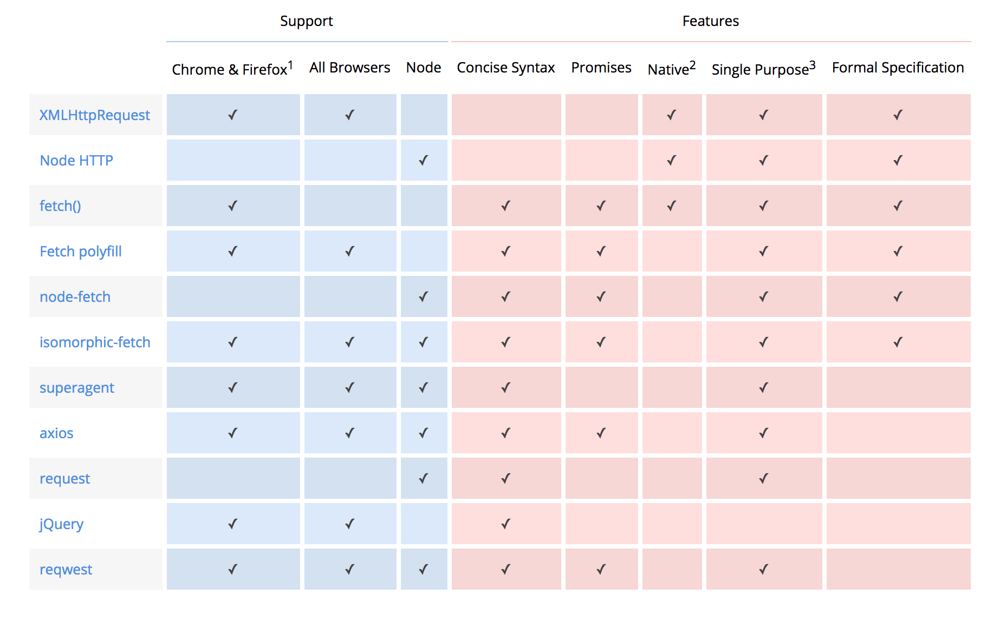

# Ajax
비동기적인 웹 어플리케이션의 제작을 위한 
클라이언트 측 웹 개발 기법

...을 뜻하나 요즈음은 의미가 변형되어 
웹 브라우저에서 XMLHttpRequest 혹은 fetch를 이용해서 보내는 HTTP 요청을 통칭하기도 함

## Ajax model

## Ajax의 장점
- 화면 전체를 다시 로드하지 않고도 내용을 갱신할 수 있어 더 나은 사용자 경험 제공
- 서버의 응답을 기다리는 동안에도 여전히 웹 어플리케이션을 사용 가능
- 필요한 자원만 서버에서 받아오게 되므로 트래픽이 줄어듬

## Ajax의 단점
클라이언트 구현이 굉장히 복잡해짐

## Ajax Library Comparison

## Axios
- Promise based HTTP client
- 브라우저와 Node.js에서 모두 사용 가능
- XMLHttpRequest, fetch에 비해 사용하기 편하고 기능이 더 많음
ref: [내가 fetch API를 쓰지 못했던 이유](https://medium.com/little-big-programming/%EB%82%B4%EA%B0%80-fetch-api%EB%A5%BC-%EC%93%B0%EC%A7%80-%EB%AA%BB%ED%96%88%EB%8D%98-%EC%9D%B4%EC%9C%A0-3c23f0ec6b82)
취소가 안되는 단점이 있다.

