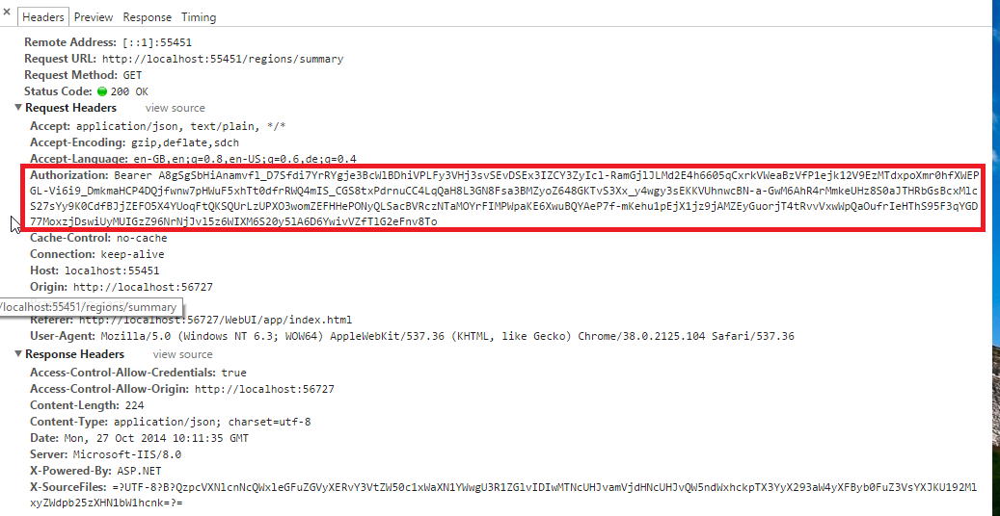
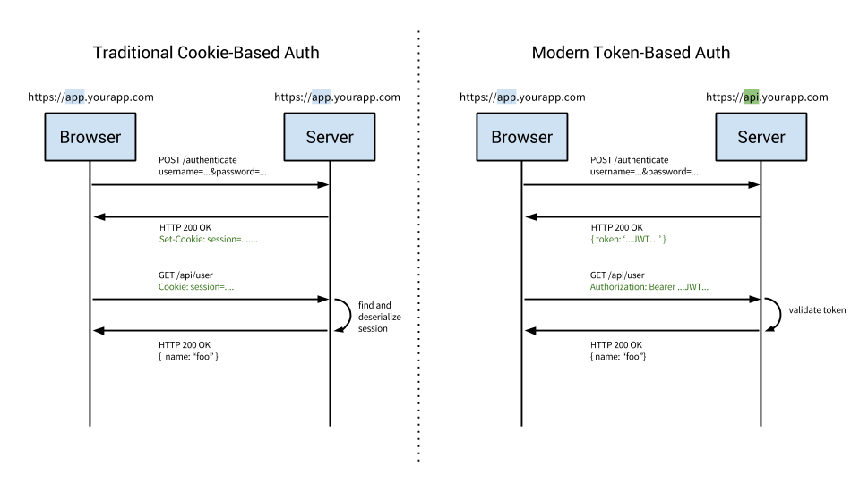

# Token Based Auth
- 토큰이란, 사용자의 자격증명(아이디, 패스워드 등)을 통해 인증이 이루어진 후, 특정 자원에 대한 자격증명으로서 대신 사용되는 인증 수단
- 서버에 요청을 할 때마다 토큰을 요청에 직접 포함시켜서 전송 (주로 Authorization 헤더에 넣어서 전송)

## Cookie vs Token

traditional
200 (이미지 잘못된건가??) > 302로 응답을 전송
modern
200 ok 

## 토큰 사용의 장점
- 다양한 인증 수단(전화번호, 공인인증서, 생체정보 등)의 인증 결과를 토큰이라는 하나의 수단으로 통일할 수 있음
- 쿠키를 사용하지 않음으로써 CORS 관련 문제를 회피할 수 있음

## 토큰 사용의 단점
- 매 요청에 토큰이 포함되게 되므로 적당히 짧은 길이를 유지해야 함
- 토큰 유출에 대한 대비책이 필요 (토큰에 유효기간을 두거나, 유출된 토큰을 강제로 무효화하는 등의 방법을 사용)
- 쿠키와는 다르게, 클라이언트에서 직접 토큰을 저장하고 관리해야 함

ㅍ

